# Agentic RAG — Architecture

```mermaid
flowchart TD

%% ─────────────────────────────────────────────────────────────
%% BROWSER
%% ─────────────────────────────────────────────────────────────
subgraph BROWSER["🖥️  Browser  (React 19 · TanStack Router · shadcn/ui)"]
    direction TB
    UI["AiChatPanel.tsx
    ─────────────────
    • Model selector
    • Quick actions
    • Export / Proposal chips
    • Streaming message list
    • react-markdown + remark-gfm"]

    DOCUI["BidDocsDrawer / SharePointModal
    ─────────────────────────────────
    • Manual upload (PDF/DOCX/XLSX)
    • SharePoint share-link paste (file or folder)
    • Per-source Sync / Remove"]

    QUERY["TanStack Query hooks
    ──────────────────────
    useAiChat · useAiSessions
    useDocuments · useSharePointSources
    useSharePointStatus · useSyncSharePoint"]
end

%% ─────────────────────────────────────────────────────────────
%% SERVER FUNCTIONS (TanStack Start SSR / Vite 7 / Bun)
%% ─────────────────────────────────────────────────────────────
subgraph SERVER["⚙️  Server Functions  (TanStack Start · Bun runtime)"]
    direction LR

    subgraph INGEST_FN["Ingestion  (doc-functions.ts + sharepoint-sync.ts)"]
        direction TB
        SPFN["addSharePointSourceFn
        ──────────────────────
        1. resolveDriveItem (share URL or Graph URL)
        2. If folder → listFolderChildren (paginated)
        3. Filter PDF / DOCX / XLSX
        4. Download bytes via @downloadUrl
        5. Upload to Supabase Storage
        6. Upsert bid_documents row (external_id dedup)
        7. → indexDocument"]

        IDXFN["indexDocument
        ────────────────
        1. Download from storage
        2. extractText (pdf-parse / mammoth / xlsx)
        3. chunkText (~1800 char, 180 overlap, sentence-aware)
        4. contextualiseChunks → Haiku (full doc cached)
        5. embedBatch → Voyage voyage-3 (128/batch, 429 retry)
        6. Delete stale chunks
        7. Insert bid_document_chunks (vector + chunk_text → fts generated)
        8. Update bid_documents.embedding (first chunk proxy)"]

        SYNCFN["syncSharePointFn
        ────────────────────
        Per stored source:
        eTag same → skip
        eTag differs, hash same → rename only (update name)
        hash differs → re-download + re-index"]
    end

    subgraph CHAT_FN["Agentic Loop  (stream-chat.ts)"]
        direction TB
        BUILD["buildSystemBlocks
        ──────────────────
        • Bid context (stage, deadline, value)
        • SEARCH_TOOL schema
        • Persona / strict KB rules
        → system array with cache_control ephemeral
        (prompt-cached across turns)"]

        LOOP["Agentic Loop  (max 3 rounds)
        ──────────────────────────────
        round N:
          Claude → stop_reason?
          ├─ tool_use → emit STATUS sentinel
          │              → runSearch → tool_result
          │              → round N+1
          └─ end_turn  → stream text deltas → done"]

        SEARCH["runSearch
        ──────────
        1. embedText(query) → Voyage voyage-3
        2. hybrid_search_chunks RPC
           (FTS ts_rank_cd + vector cosine, RRF fusion, top-50)
        3. rerank → Voyage rerank-2.5 → top-8
        4. formatChunks → tool_result content"]
    end
end

%% ─────────────────────────────────────────────────────────────
%% EXTERNAL AI SERVICES
%% ─────────────────────────────────────────────────────────────
subgraph AI["🧠  AI Services"]
    CLAUDE["Anthropic Claude
    ─────────────────
    claude-opus-4-8
    claude-sonnet-4-6  ← default
    claude-haiku-4-5   ← contextualiser + fast
    (+ Azure GPT-5 / OSS-120B via AzureOpenAI SDK)"]

    VOYAGE["Voyage AI
    ──────────
    voyage-3        → 1024-dim embeddings
    rerank-2.5      → cross-encoder reranking"]
end

%% ─────────────────────────────────────────────────────────────
%% SUPABASE
%% ─────────────────────────────────────────────────────────────
subgraph DB["🗄️  Supabase  (Postgres + pgvector + Auth + Storage)"]
    direction LR

    BDOCS["bid_documents
    ──────────────
    source: uploaded | generated | sharepoint
    external_id / eTag / hash / url  (SharePoint provenance)
    embedding vector(1024)  (first-chunk proxy)"]

    CHUNKS["bid_document_chunks
    ─────────────────────
    chunk_text  text
    embedding   vector(1024)   ← cosine search
    fts         tsvector  GENERATED  ← GIN index, FTS arm
    chunk_index int"]

    SESSIONS["ai_sessions
    ────────────
    messages  JSONB  (full history)
    model     text
    title     text  (optional rename)
    bid_id    uuid | null"]

    ORG["org_settings
    ──────────────
    sharepoint_creds      (tenantId / clientId / secret)
    sharepoint_last_synced
    hubspot_token
    — admin-only RLS —"]

    STORAGE["Supabase Storage
    ─────────────────
    bucket: bid-documents
    path: sharepoint/{itemId}/{name}
    path: uploads/{bidId}/{name}"]

    RPCFN["hybrid_search_chunks RPC
    ──────────────────────────────
    scope:
      bid_id = match_bid_id   (bid docs)
      OR bid_id IS NULL       (global + SharePoint)
    FTS arm:  websearch_to_tsquery + ts_rank_cd
    Vec arm:  embedding <=> query_embedding (cosine)
    fusion:   RRF (k=50) → top match_count
    "]
end

%% ─────────────────────────────────────────────────────────────
%% MICROSOFT GRAPH
%% ─────────────────────────────────────────────────────────────
GRAPH["Microsoft Graph API
    ─────────────────────
    POST /oauth2/v2.0/token    (client_credentials)
    GET  /shares/{encoded}/driveItem
    GET  /shares/{encoded}/driveItem/children   (folder)
    GET  /drives/{driveId}/items/{itemId}       (sync)
    @microsoft.graph.downloadUrl                (temp DL URL)"]

%% ─────────────────────────────────────────────────────────────
%% EDGES — Ingestion
%% ─────────────────────────────────────────────────────────────
DOCUI -->|"share URL / file bytes"| SPFN
SPFN -->|"OAuth2 client_credentials\nencode + resolve"| GRAPH
GRAPH -->|"driveItem + downloadUrl"| SPFN
SPFN -->|"upload bytes"| STORAGE
SPFN -->|"upsert row"| BDOCS
SPFN -->|"documentId"| IDXFN
DOCUI -->|"manual upload → indexDocument"| IDXFN
IDXFN -->|"download bytes"| STORAGE
IDXFN -->|"contextualise chunks"| CLAUDE
IDXFN -->|"embed chunks (voyage-3)"| VOYAGE
IDXFN -->|"insert chunks"| CHUNKS
IDXFN -->|"update embedding"| BDOCS
SYNCFN -->|"resolve via Graph URL"| GRAPH
SYNCFN -->|"re-download if content changed"| GRAPH
SYNCFN -->|"→ indexDocument"| IDXFN

%% ─────────────────────────────────────────────────────────────
%% EDGES — Chat / Agentic loop
%% ─────────────────────────────────────────────────────────────
UI -->|"POST streamChat\n(sessionId, bidId, messages, model)"| BUILD
BUILD -->|"system blocks + messages"| LOOP
LOOP -->|"messages API streaming"| CLAUDE
CLAUDE -->|"tool_use: search_knowledge_base"| LOOP
LOOP -->|"query + bidId"| SEARCH
SEARCH -->|"embedText(query)"| VOYAGE
SEARCH -->|"hybrid_search_chunks\n(FTS + vector, RRF)"| RPCFN
RPCFN -->|"top-50 candidates"| SEARCH
SEARCH -->|"rerank-2.5"| VOYAGE
VOYAGE -->|"top-8 reranked chunks"| SEARCH
SEARCH -->|"tool_result"| LOOP
CLAUDE -->|"end_turn: text stream"| UI
LOOP -->|"\\x1fSTATUS\\x1f sentinel\n(search progress)"| UI
LOOP -->|"\\x1eEXPORT\\x1e sentinel\n(download chip)"| UI

%% ─────────────────────────────────────────────────────────────
%% EDGES — Session persistence
%% ─────────────────────────────────────────────────────────────
LOOP -->|"persist messages + model"| SESSIONS
QUERY -->|"list / rename / delete sessions"| SESSIONS

%% ─────────────────────────────────────────────────────────────
%% EDGES — SharePoint creds
%% ─────────────────────────────────────────────────────────────
SPFN -->|"read creds\n(supabaseAdmin, bypasses RLS)"| ORG
SYNCFN -->|"read creds"| ORG
SYNCFN -->|"write last_synced"| ORG

%% ─────────────────────────────────────────────────────────────
%% STYLES
%% ─────────────────────────────────────────────────────────────
classDef ext fill:#1a1a2e,stroke:#4f8ef7,color:#e0e0ff
classDef db  fill:#0d1b2a,stroke:#2ecc71,color:#e0ffe0
classDef srv fill:#1c1c1c,stroke:#ff6b35,color:#ffe0d0
classDef cli fill:#1a1a1a,stroke:#a855f7,color:#f0e0ff

class CLAUDE,VOYAGE ext
class BDOCS,CHUNKS,SESSIONS,ORG,STORAGE,RPCFN,GRAPH db
class SPFN,IDXFN,SYNCFN,BUILD,LOOP,SEARCH srv
class UI,DOCUI,QUERY cli
```

---

## Key Design Decisions

| Decision | Why |
|---|---|
| **Tool-use loop (max 3 rounds)** | Claude decides when/what to search — no static chunk pre-stuffing |
| **Hybrid search (FTS + vector, RRF)** | Keyword precision + semantic recall; neither alone covers all query types |
| **Voyage rerank-2.5 after RRF** | Cross-encoder rescoring on top-50 candidates → top-8 quality gate |
| **Contextual Retrieval (Haiku blurb)** | Situates each chunk in document context before embedding, improving retrieval hit rate |
| **`bid_id IS NULL` = global scope** | SharePoint + template docs surface in every chat session automatically |
| **Prompt caching on system blocks** | Tool schema + stable persona cached across turns → lower latency + cost |
| **`\x1f` / `\x1e` sentinel channels** | Multiplex search progress and export metadata over a single SSE stream without JSON overhead |
| **Graph API URL as `external_url`** | Folder children store a stable item URL so sync works without the original folder share link |
